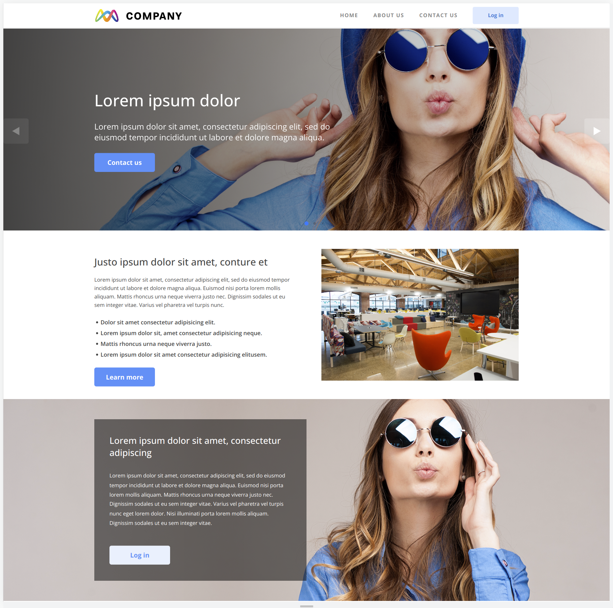
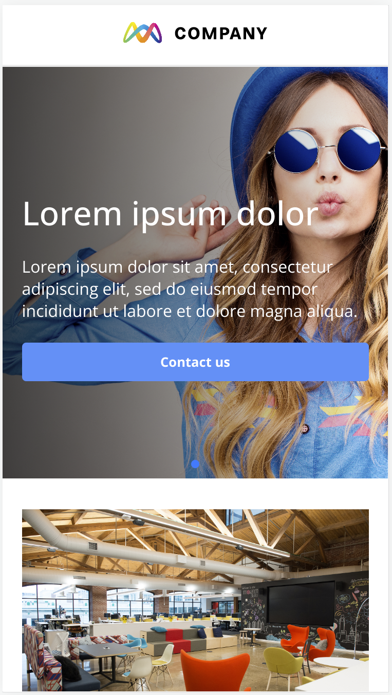
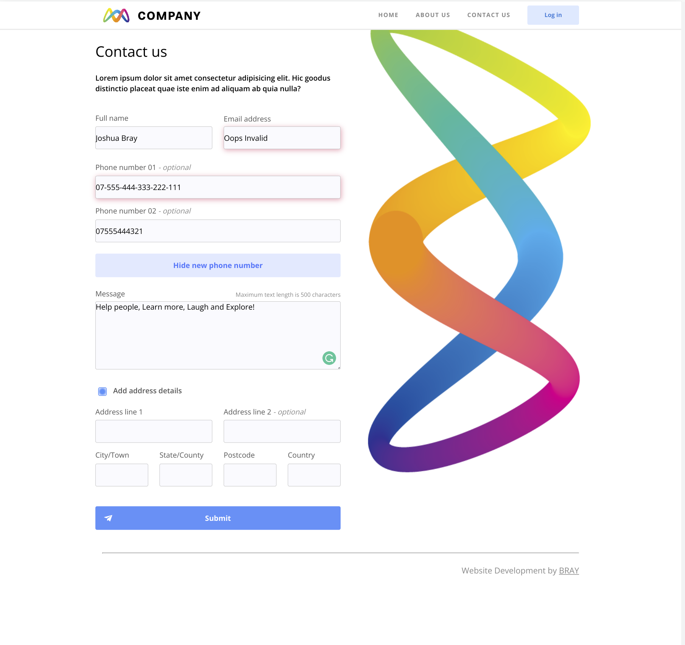
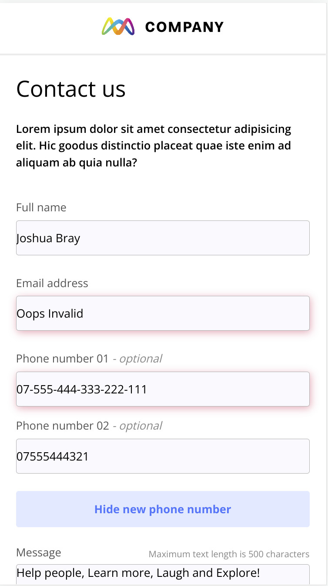

# interactive-website

## This is a project build to demonstrate my knowledge of React.

### Designs are built for Mobile and Desktop (1200px)

## Built in just 2.5 days

### Features include:

- React Router
- API Fetch: GET + POST
- Conditional rendering
- Data composition/ handling
- Mobile first design with @media break points

## Clone the repo to your local:

`git clone git@github.com:Brayve-Pancake/interactive-website-repo.git`

## Install dependencies:

`npm i`

## Launch Vite:

`npm run build`

`npm run preview`

## Launch Vite in Dev mode:

`npm run dev`

# This is what it looks like:

gh-pages: https://brayve-pancake.github.io/interactive-website-repo/

